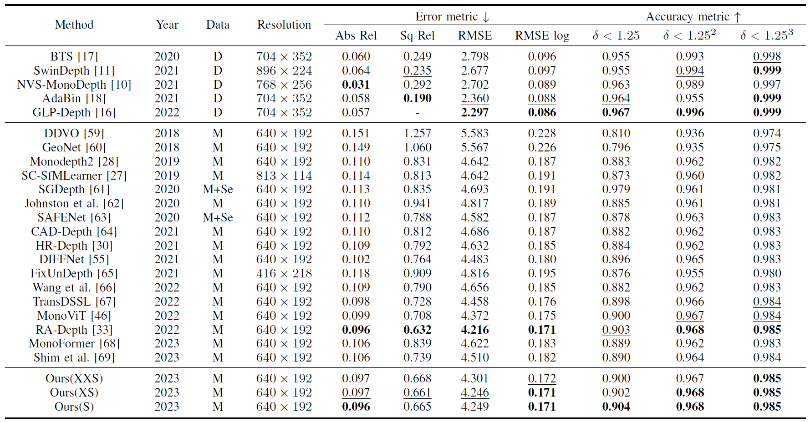
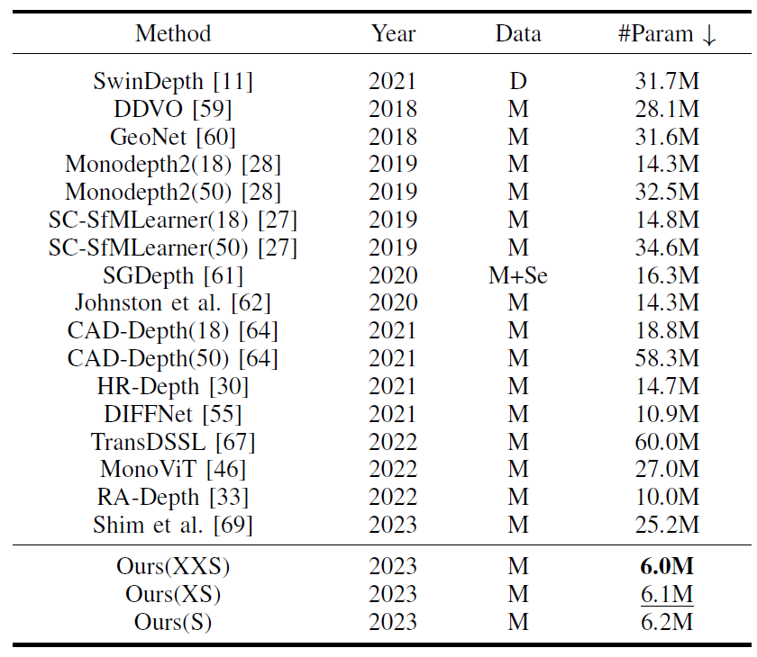
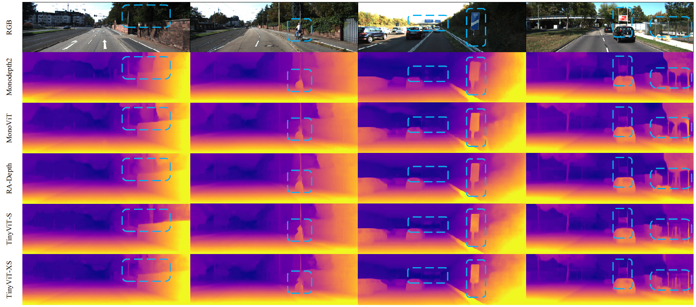

# TinyDepth

This work is our paper, TinyDepth: Lightweight Self-Supervised Monocular Depth Estimation Based on Transformer.
[[paper link]](https://www.sciencedirect.com/science/article/pii/S0952197624014714)


Please consider citing it if you think it is a useful work.
## Citation

    @article{cheng2024tinydepth,
    title    ={TinyDepth: Lightweight self-supervised monocular depth estimation based on transformer},
    author   ={Cheng, Zeyu and Zhang, Yi and Yu, Yang and Song, Zhe and Tang, Chengkai},
    journal  ={Engineering Applications of Artificial Intelligence},
    volume   ={138},
    pages    ={109313},
    year     ={2024},
    publisher={Elsevier}
    }


## Results on KITTI dataset


## Parameters comparison results


## Visualization results on KITTI dataset



## Training:

```
CUDA_VISIBLE_DEVICES=0 python train.py --model_name Tiny-Depth --scales 0 --png --log_dir models --data_path /datasets/Kitti_raw_data
```


## Testing:

```
CUDA_VISIBLE_DEVICES=0 python evaluate_depth.py --load_weights_folder /models/Tiny-Depth/ --eval_mono --height 192 --width 640 --scales 0 --data_path /datasets/Kitti_raw_data --png
```


#### Acknowledgement
 - Thank the authors for their superior works: [monodepth2](https://github.com/nianticlabs/monodepth2), [RA-Depth](https://github.com/hmhemu/RA-Depth), [MonoViT](https://github.com/zxcqlf/MonoViT)
 
 
