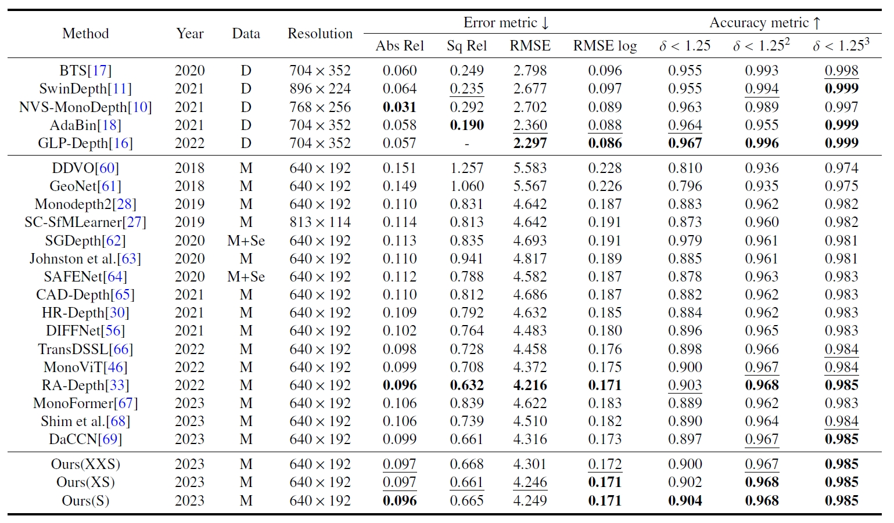
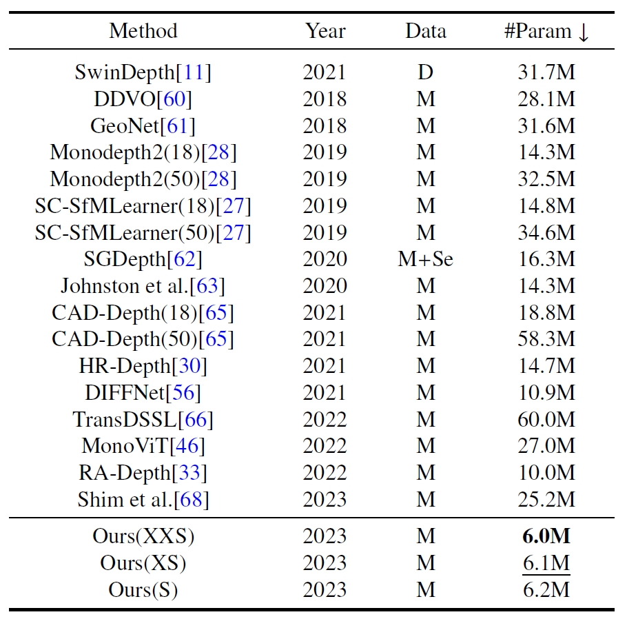

# TinyDepth

This work is an early version of our submission paper, TinyDepth: Lightweight Self-Supervised Monocular Depth Estimation Based on Transformer, (TCSVT).


We will update the full version after the article is accepted, please consider citing it if you think it is a useful work.


## Results on KITTI dataset


## Parameters comparison results


## Visualization results on KITTI dataset


## Training:

```
CUDA_VISIBLE_DEVICES=0 python train.py --model_name Tiny-Depth --scales 0 --png --log_dir models --data_path /datasets/Kitti_raw_data
```


## Testing:

```
CUDA_VISIBLE_DEVICES=0 python evaluate_depth.py --load_weights_folder /models/Tiny-Depth/ --eval_mono --height 192 --width 640 --scales 0 --data_path /datasets/Kitti_raw_data --png
```


#### Acknowledgement
 - Thank the authors for their superior works: [monodepth2](https://github.com/nianticlabs/monodepth2), [RA-Depth](https://github.com/hmhemu/RA-Depth), [MonoViT](https://github.com/zxcqlf/MonoViT)
 
 
